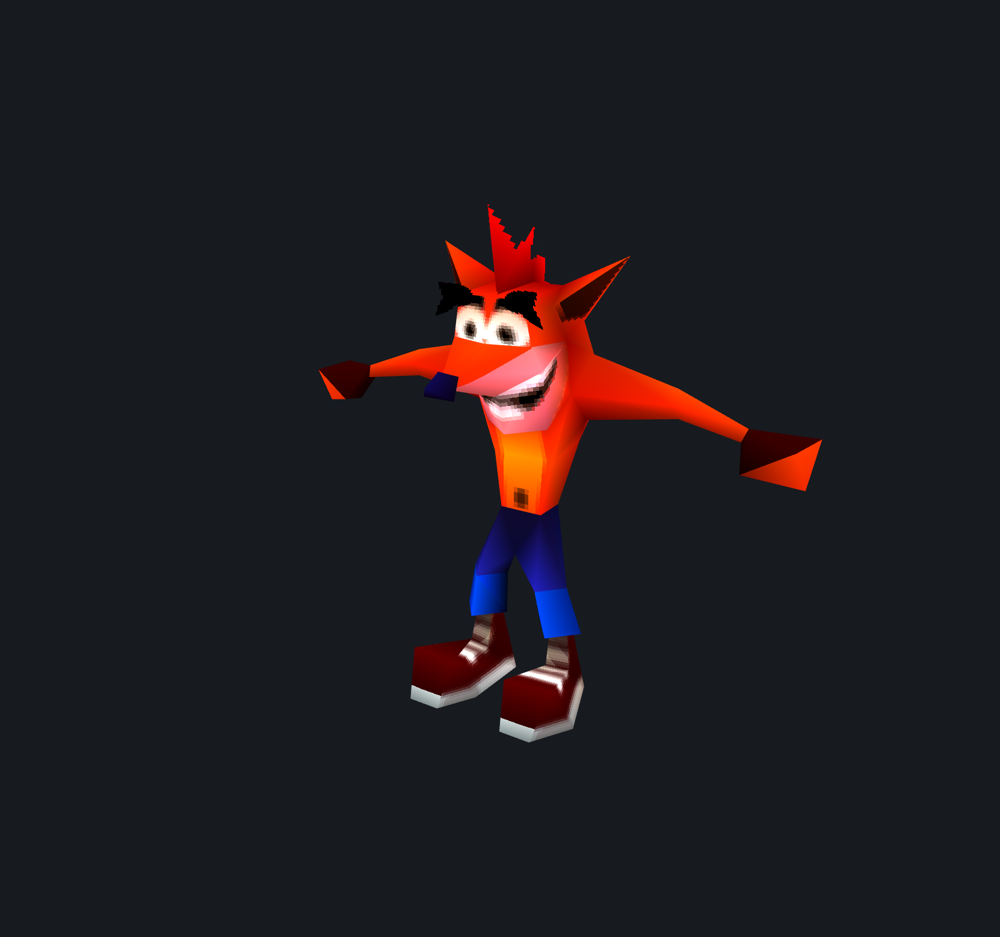

# Bash Editor

An editor for Crash Bash's `CRASHBSH.DAT`, cross-platform (macOS / Windows / Linux)
in pure Python — PySide6 + OpenGL, no platform-specific code.

**Where it stands.** Reading is done and verified: every model, texture, sound bank
and animation clip in the game parses, renders and exports. Writing back into the
archive is the goal and is **not implemented yet** — [Towards editing](#towards-editing)
sets out what each kind of edit still needs.

The container format and the build/MD5 table come from
[CTR-tools](https://github.com/CTR-tools/CTR-tools) (dcxdemo). The 3D format was
re-derived here against the game's own executable; several readings that made earlier
exports come out scrambled are corrected, and the whole format is written up in
[docs/FORMAT.md](docs/FORMAT.md).



## Running

```bash
python3 -m venv .venv && .venv/bin/pip install -r requirements.txt
.venv/bin/python app/main.py
```

Then **File → Open game EXE…** and pick your `SCUS_945.70` (or drop the EXE or its
folder onto the window). `CRASHBSH.DAT` must sit next to the EXE or in a `CRASHBSH/`
subfolder — the file table lives inside the EXE, so both are needed. The game files
are not part of this repository; point the editor at your own copy.

The last-opened EXE is reloaded automatically on the next launch.

## What is readable

Measured against the NTSC-U release (992 entries):

| | Result |
| --- | --- |
| Archive | 992/992 entries, with the real file names |
| Models | 5990/5990 meshes reconstruct exactly the triangle count the file states |
| Colours | gouraud, three per triangle, semi-transparency flags decoded |
| Textures | 15160 textures from 400 packs, 4- and 8-bit, with transparency |
| Animation | 1037 clips over 49167 frames, in 225 of 400 models |
| Sound | 160/160 VAB banks, 2581 samples decoded to PCM, 57 sequences |

Other builds (PAL, JPN, the prototypes and demos) load too, but only NTSC-U has known
file names — everything else shows as `00000.mdl` and friends.

## Using it

The tree filters by kind and opens on **Models**, since each model sits next to its
texture pack in the archive and only `.mdl` entries open in the viewport.

| Input | Action |
| --- | --- |
| Left-drag | Orbit |
| Right/middle-drag, or Shift+drag | Pan |
| Wheel, trackpad scroll, or pinch | Zoom |
| `+` / `-` | Zoom in / out |
| `0` | Fit the model, keeping the angle |
| `F` | Reset view |

Toggles for solid / wireframe / points / textures / vertex colours sit under the
viewport, and individual meshes can be hidden from the **Model** panel.

**Vertex colours** is worth knowing about. The file stores three colours per triangle
and they multiply into the texture, so switching them off is the only way to see a
texture as it sits in the pack — and it separates the surfaces that are genuinely
textured from the ones that are flat-coloured, which on a character is most of the
body. Those colours also carry the model's shading, so with them off the viewport
lights the geometry itself instead.

### Animation

A model's clips are listed under the mesh list, with a play button and a frame slider.
Clip names are stored only as a hash, so the panel shows a name when one guess fits,
both when two do (`HIT / HOP`), and the raw hash when none does.

### Sound

Selecting an `.sfx` entry lists the bank's samples; pressing play decodes the SPU-ADPCM
and plays it. Whole banks export as WAV. The music sequences are PS1 `SEQp` data and
would need a sequencer driving the bank to play, which this editor does not have —
export those for a tool that does.

## glTF export

**File → Export model as glTF…** (`Ctrl+G`) writes one `.glb` holding the geometry,
the textures and every animation clip. It is the route out to a modelling tool, and
the mapping is exact rather than approximate:

| In the file | In glTF |
| --- | --- |
| keyframe | morph target (POSITION deltas) |
| frame record: keyframe A, keyframe B, 12-bit weight | one sample of a `weights` channel, two entries set |
| `A + (B − A) · w` | what a morph target already means |
| per-triangle gouraud colour | `COLOR_0` |
| per-triangle texture | one primitive per texture, one material each |

Rebuilding every pose as a weighted sum of keyframe poses — what a glTF renderer
does with that weights channel — reproduces the decoder's own output to within
0.0039 model units, and that figure is exactly 1/256: one step of the fixed point
the positions are stored in. The gap is the game's rounding, not a mismatch.

All 373 models with geometry export, carrying 1037 clips, and an independent glTF
library reads them all back.

In Blender the morph targets arrive as shape keys with the clips driving them, so a
character can be retargeted with the tools that already exist there.

Two things do not survive, both knowingly. The PS1 blend is `texel * colour / 128`,
so a colour above 128 brightens the texel; glTF has no such headroom, so `COLOR_0`
carries the doubled colour clamped to 1. And glTF has no triangle strips, so
re-importing means re-striping the mesh — which changes the vertex order, and since
a clip indexes vertices by their position in the pool, the clips have to be rewritten
with it. Model and animation cannot be imported separately.

## Command line

```bash
.venv/bin/python -m crashbash.cli info    game/SCUS_945.70
.venv/bin/python -m crashbash.cli list    game/SCUS_945.70 -f chars/
.venv/bin/python -m crashbash.cli extract game/SCUS_945.70 -o out
.venv/bin/python -m crashbash.cli obj     game/SCUS_945.70 -o out -f chars/
.venv/bin/python -m crashbash.cli glb     game/SCUS_945.70 -o out -f chars/
.venv/bin/python -m crashbash.cli audio   game/SCUS_945.70 -o out   # VB/VH/SEQ
.venv/bin/python -m crashbash.cli wav     game/SCUS_945.70 -o out   # decoded WAV
.venv/bin/python -m crashbash.cli png     game/SCUS_945.70 -o out   # needs pillow
```

## Building a disc

```bash
.venv/bin/python -m crashbash.cli build game/SCUS_945.70 -o out/disc
```

That writes a complete disc tree: `CRASHBSH.DAT` repacked, `SCUS_945.70` patched to
match, and everything else copied through. It then re-reads its own output with the
same parser the editor uses and reports how many of the 992 entries came back
byte-identical, so a build that quietly corrupts the table cannot pass.

The DAT has no directory of its own — the game finds an entry through a table of 992
`(sector, size)` pairs compiled into the executable, and loads entries a *group* at a
time through a second table of 130 records. Writing one entry means rewriting both
tables, and they have to agree exactly. Entries keep their index and groups keep their
membership, so anything referring to either by number still works.

The output is packed tighter than the disc's own layout, on purpose. The original
reserves a spare sector for 12 entries and leaves padding inside 8 groups, which makes
a group's span disagree with the byte count the loader reads with; packing tight makes
the two identical and saves 24 KB.

Mastering the tree into a disc image is a separate step, because a tree is already
useful — most emulators run one straight from a folder. The build writes an
[mkpsxiso](https://github.com/Lameguy64/mkpsxiso) project beside it:

```bash
mkpsxiso out/disc.xml
```

`BASHY.` is a raw 2352-byte-sector stream and is marked as such so it is copied
sector-for-sector rather than padded as data. No licence sector is written — that data
is Sony's and is not in this repository — so the image runs in emulators but not on
hardware unless you pass the original disc's licence to mkpsxiso with `-l`.

## Towards editing

What is still missing, and why. [docs/FORMAT.md](docs/FORMAT.md) §14 lists every open
question.

**Geometry.** Writable in principle today — the strip list, the vertex pool, the
per-triangle UV/texture/colour arrays and the shared tables are all confirmed, so a
mesh can be rebuilt from scratch. The catch is that a strip list is a fixed partition
of the vertex pool: changing a triangle count means re-striping the mesh, not patching
a field.

**Textures.** Reading is solid, writing is not. How a pack is placed in VRAM is still
unknown: pack header `0x14`/`0x18` and texture record `+0x04..+0x07`, `+0x0E`, `+0x10`
are unidentified, so a repacked pack could decode correctly here and still land wrong
on the console. Replacing the pixels of an existing texture is safe; adding one or
changing its size is not.

**Animation.** The clip format is fully decoded, including the shared position pool and
the blend weights, so clips can be rewritten. What the per-frame auxiliary block holds
is still unknown, so an editor must copy it through untouched.

**Sound.** VB/VH/SEQ are standard PS1 formats, so a bank can be rebuilt with existing
tools. Only the trimmed VAG offset table is non-standard, and it is documented.

## Format

[docs/FORMAT.md](docs/FORMAT.md) is the reference: every field with an offset, a type
and a confidence marker, the corpus measurement behind each claim, and the disassembly
that settles it. The short version of what matters most:

- Every pointer, in the file header and the mesh headers alike, is relative to its own
  position: `ptr = base + field_offset + value`.
- A mesh's strip list gives each strip's triangle count in the **high** byte of its
  `u16`, with flags in the low byte and a high byte of `0xFF` ending the list. Each
  strip spans `count + 2` vertices from the pool in order. Reading those two bytes the
  other way round is what scrambles other tools' exports.
- Colours are gouraud: the per-triangle colour index names three consecutive table
  entries, one per corner, and those colours already carry the shading — light them
  again and the dark side crushes to black.
- The three UVs correspond to the strip's three vertices **positionally**. Rotating a
  triangle's corners to normalise its facing, without rotating the UVs alongside, lands
  the texture on it mirrored.
- A texture entry's bit 15 does not mean "untextured": the triangle samples the pack's
  palette-less swatch texture, and the entry's low 9 bits name a **palette** instead of
  a texture. That is how one mesh paints itself in several colour schemes from a single
  16×16 image.

## Layout

```
crashbash/            format library, no GUI dependency
  binreader.py        little-endian reader, PS1 fixed-point scales
  archive.py          EXE version table, DAT entry table, extraction
  formats/mdl.py      models: bounds, vertices, strips, colours, UVs, textures
  formats/anim.py     animation clips: keyframes, blending, posed vertices
  formats/tex.py      texture packs: BGR555 palettes, 4/8-bit images
  formats/sfx.py      sound banks: VAB header, SPU-ADPCM decoder, WAV output
  formats/gltf.py     glTF 2.0 export: geometry, textures, morph animation
  build.py            repack the DAT, patch the EXE tables, write a disc tree
  cli.py              headless commands
app/                  PySide6 GUI
  glview.py           OpenGL 3.3 core viewport, orbit camera, textured, animated
  atlas.py            packs a .tex pack into one atlas for the viewport
  panels.py           file tree, mesh list, animation, texture/audio/hex panels
  window.py           main window and export actions
  main.py             entry point
tools/psxdis.py       MIPS disassembly helper for checking claims against the EXE
docs/FORMAT.md        the format specification, field by field
```

## Credits

`bash_dat`, the build/MD5 table and `bash_filelist.txt` are from CTR-tools by dcxdemo
and contributors. The specification records where this reading departs from theirs, and
why.
